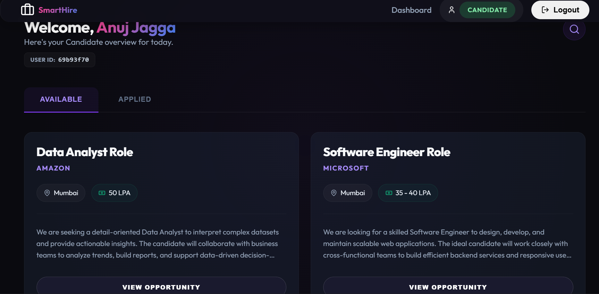
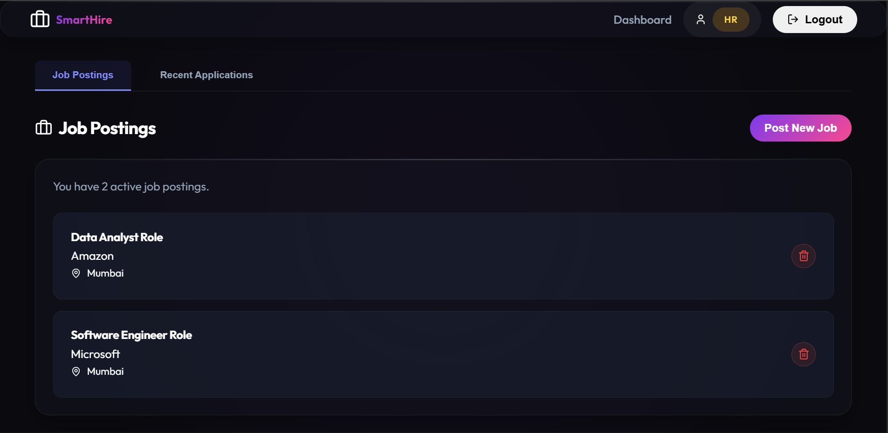
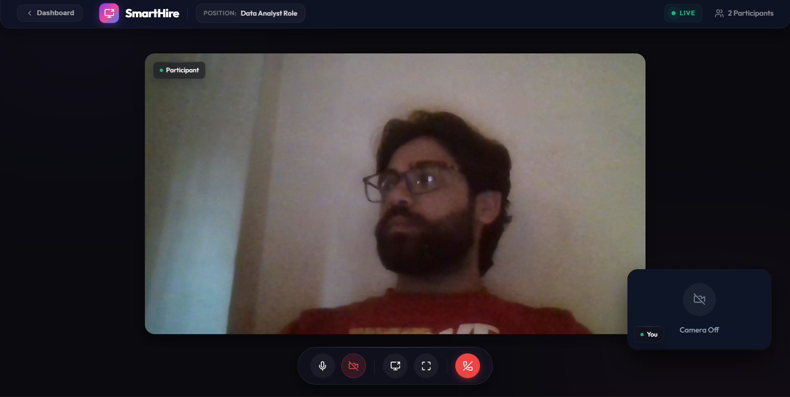

# SmartHire - Interview & Placement Management System

⚡ **Built with real-time WebRTC video interviews and production-grade security practices.**

SmartHire is a full-stack MERN platform designed to bridge the gap between application tracking and live interviewing. This project simulates a real-world enterprise recruitment pipeline, focusing on high-performance communication, architectural security, and a premium "wow-factor" user experience.

---

## 📸 Screenshots

### 👨💻 Candidate Dashboard – Browse Jobs


<br/>

### 🧑💼 HR Dashboard – Manage Job Postings


<br/>

### 🎥 Real-Time Interview (WebRTC)
Peer-to-peer video interviews using WebRTC with STUN/TURN connectivity, live participant tracking, and in-call media controls.



---

## 💡 About & Motivation

Built to simulate a real-world hiring pipeline, SmartHire addresses the complexity of peer-to-peer signaling and state management. The goal was to create a recruiter-ready tool that handles the messiness of real-time media while maintaining strict security via HTTP-only protocols.

---

## 🏗️ Architecture

- **Frontend**: React (Vite), Zustand, Axios
- **Backend**: Node.js, Express REST APIs
- **Real-time**: Socket.IO (Signaling) + WebRTC (Media Stream)
- **Background Tasks**: BullMQ + Redis (Asynchronous Email Queueing)
- **Database**: MongoDB Atlas (Cloud Managed)

---

## 🚀 Key Features

### 👤 Role-Based Workflows
- **Candidate**: Browse jobs, view detailed descriptions, and apply with a single click.
- **HR Professional**: Post new job openings, manage applicants, and initiate interviews.
- **Admin**: Monitor system-wide activity feeds and user registrations in real-time.

### 🔐 Security & Auth
- **HTTP-Only Cookies**: JWT tokens are stored in secure cookies to prevent XSS attacks.
- **Bcrypt**: Industrial-grade password hashing for user data protection.
- **Protected Routes**: Granular access control for API endpoints and UI views.

### 🎥 Native WebRTC interviews
- **Peer-to-Peer**: High-performance real-time video/audio communication.
- **Draggable PiP**: Custom-built draggable local video preview for a better user experience.
- **Live Monitoring**: Pulsating status indicators for a professional room atmosphere.

---

## 🔥 Technical Highlights & Enhancements

- **"Nuclear Cleanup" Logic**: Engineered strict MediaStream track termination and signaling disconnects to prevent browser memory leaks and rogue camera/mic usage—addressing a common real-world WebRTC pitfall.
- **Cloud Migration**: Successfully migrated the database layer from local MongoDB to **MongoDB Atlas** for production-grade reliability and scalability.
- **WebRTC Reliability**: Implemented ICE servers (STUN/TURN) to ensure connectivity across restrictive corporate firewalls.
- **Distributed Task Queueing**: Implemented a resilient, non-blocking email dispatch system using **BullMQ and Redis**, ensuring high-volume operations don't interfere with the main event loop.
- **Observability**: Designed a custom Analytics Engine to log system events and broadcast them to the Admin dashboard in real-time.

---

## 🛠️ Installation & Setup

### 1. Backend
- Located in: `backend/`
- Runs on: [http://localhost:5000](http://localhost:5000)
```bash
npm install
npm run dev
```

### 2. Frontend
- Located in: `frontend/`
- Runs on: [http://localhost:5173](http://localhost:5173)
```bash
npm install
npm run dev
```

---

## 🔑 Environment Variables

Create a `.env` file inside the `backend/` directory:

```env
PORT=5000
MONGO_URI=your_mongodb_atlas_uri
JWT_SECRET=your_jwt_secret
```

> [!IMPORTANT]
> Make sure MongoDB Atlas is configured and your IP is whitelisted before starting the backend.

---

## 📄 License
MIT
